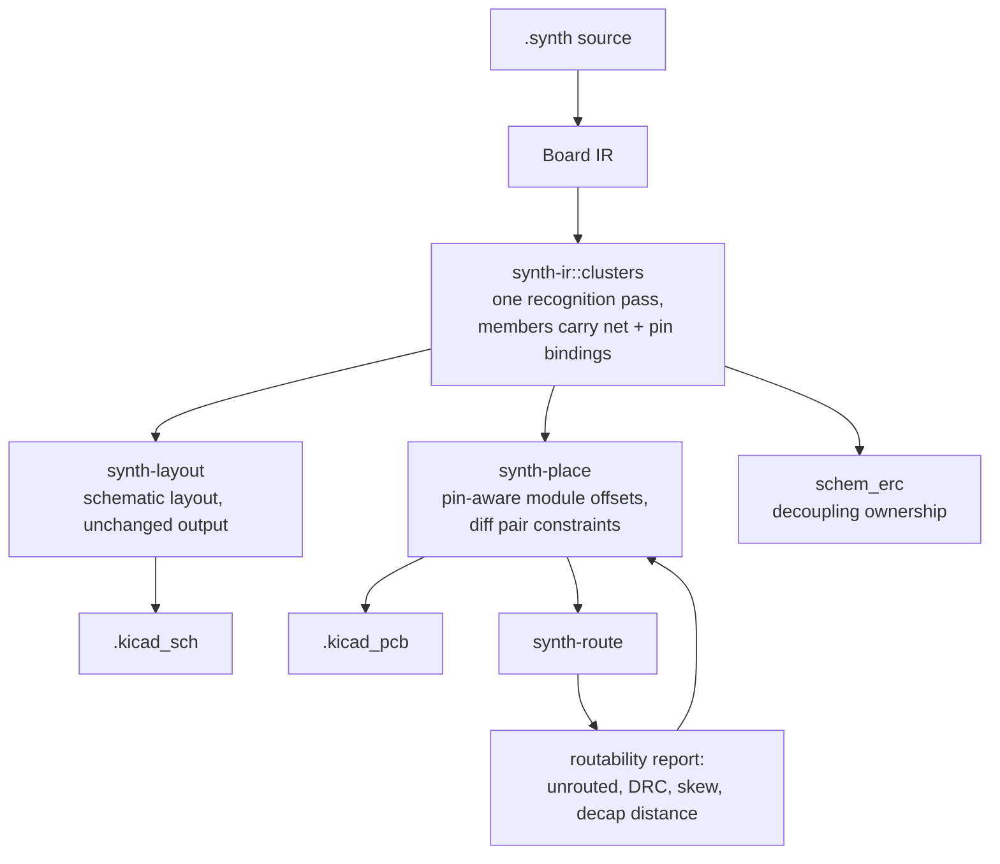

# Plan: schematic-derived placement hints for routability

Status: approved 2025-02, Phase 1 in progress.
Decisions recorded in "Decisions" below.

## Problem

Placement today is driven by component kind, `placement_hint` blocks,
floorplan rules, and CEM seeds. Three consequences:

1. Decoupling capacitors land at one of eight fixed pattern offsets
   around the IC's courtyard centre, not next to the pad they decouple
   (`crates/synth-place/src/modules.rs`).
2. Differential pairs influence routing priority only. Nothing in the
   placer reads `Board.diff_pairs`, so the router inherits whatever
   geometry the greedy pass happened to produce
   (`crates/synth-route/src/diff_pair.rs:28-40`).
3. Functional-cluster recognition is duplicated across three consumers
   that have drifted apart (schematic patterns, PCB modules, schematic
   ERC), so "the schematic says these belong together" is not a fact the
   PCB placer can act on.

The result is legal placements that route badly, and an agent loop
(`docs/rp2350-agent-workflow.md`) that has to hand-patch clusters the
compiler already knows about.

## Goals

- One recognition pass over the IR; schematic layout, PCB placement, and
  ERC agree on cluster membership and on the pin/net that binds each
  member to its anchor.
- PCB placement consumes those clusters as pin-aware relationships:
  decoupling caps land adjacent to the power pad they decouple, diff
  pair endpoints are pulled together and oriented to face each other.
- No schematic coordinate ever crosses into PCB placement. What crosses
  is a relationship.
- Deterministic output. Existing determinism and golden tests stay green.
- Measurable improvement: unrouted nets, DRC violations, max
  decap-to-pin distance, diff pair skew, all tracked before/after.

## Non-goals

- Schematic-to-PCB coordinate mapping of any kind.
- Coupled-lane diff pair routing and serpentine length tuning (deferred
  router work; this plan only makes placement give the router geometry it
  can couple).
- Any change to `synth-ir::Board` layout semantics, module flattening,
  or the sidecar file formats.

## Architecture

The shared pass lives in `crates/synth-ir/src/clusters.rs`. All three
consumers already depend on `synth-ir`, and `synth-place` must not depend
on `synth-route`, so the diff pair net resolver moves to `synth-ir` too
rather than being called across that boundary.

## Phases

### Phase 1 - shared recognition (no behaviour change)

- `synth-ir::clusters`: `FunctionalCluster { kind, anchor, members }`,
  `ClusterMember { component, role, binding }`,
  `MemberBinding { net, anchor_pin, member_pin }`.
- Passes in fixed precedence order: LED indicator, USB+ESD, LDO block,
  I2C bus, crystal, IC block, divider, RF matching, orphan rail-cap
  adoption, singleton. The `claimed` set and ordering are shared, so
  membership is identical for every consumer by construction.
- `role` distinguishes decoupling cap, reset network part, pull-up, ESD
  diode, load cap, rail cap, divider partner, series element, matching
  element. Schematic presentation (`MemberSide`, `anchor_vertical`) is
  derived from `role` by `synth-layout`; PCB offsets are derived from
  `binding` by `synth-place`. Neither side re-decides membership.
- Migrate `synth-layout` patterns to an adapter over the shared pass, and
  `synth-place::modules::extract_functional_modules` plus
  `build_cluster_pairs` likewise. Delete the duplicated recognition.
- Parity tests: same membership as before, on the example corpus.
- Out of scope here: `schem_erc`'s nearest-IC ownership rule is
  geometric (it needs schematic coordinates) and stays as is until
  Phase 5.

### Phase 2 - pin-aware PCB module placement

- Replace `compute_dynamic_module_offsets` pattern indexing with offsets
  derived from `MemberBinding`: member centre = anchor pad position plus
  a clearance gap along the pad's outward normal.
- Member rotation turns the member's connected pad toward the anchor pad,
  so the connection is a short direct run.
- Nets needing several caps (registry `required_decoupling.count > 1`,
  e.g. RP2350 `iovdd` x4) fan deterministically around the anchor pad in
  IR order.
- Crystal load caps, USB ESD diodes, and regulator rail caps get the same
  treatment through the shared bindings.
- The existing pad-aware hard-`near` shortcut (`synth-place/src/lib.rs`
  `near` handling) is generalised to use `MemberBinding` instead of
  "first shared net".

### Phase 3 - differential-pair-aware placement

- Move diff pair resolution into `synth-ir`; extend the capability
  fallback beyond USB so USB, RS-485, and LVDS pairs resolve from
  `PinCapability` rather than from the DP/DN label heuristic.
- Placement effects per resolved pair:
  - endpoint attraction: the components terminating both halves are
    pulled toward each other as soft targets, not hard constraints;
  - escape orientation: each endpoint rotates so its pair pads face the
    other endpoint, with P/N order preserved (never mirrored);
  - in-line parts: series elements and ESD diodes claimed on pair nets
    are placed on the corridor between endpoints.
- Pair geometry is reported in the placement description.

### Phase 4 - re-enable cost refinement

- `refine_swaps` (`synth-place/src/lib.rs`) comes back on the tuning
  path with cost = HPWL + cluster cohesion over shared clusters +
  a diff pair endpoint-distance term.
- Acceptance: determinism test unchanged, no new DRC or unrouted
  regressions, and placement time within 2x current on the RP2350
  board. If the time budget is blown, cohesion folds into greedy target
  selection instead and the swap stage stays off.

### Phase 5 - routability feedback

- `PlacementDescription` gains per-cluster satisfaction (max and mean
  member-to-anchor-pad distance) and per-pair geometry (endpoint
  distance, estimated skew).
- MCP `synth_describe_placement`, `synth_place_with_hints`, and
  `synth_route` surface those numbers, and link unrouted nets to the
  clusters that contain them.
- Export repair loop gains an intermediate relaxation step: derived
  module offsets relax before explicit user hints do.
- New warning diagnostics for decap distance and pair geometry, under
  `docs/diagnostics/`.
- `schem_erc` adoption of shared clusters for decoupling ownership.

### Phase 6 - explicit syntax (in scope for the first iteration)

Inference covers the common cases; syntax is the escape hatch for
when it guesses wrong.

- Pin-qualified near: `placement_hint { near: U1.dvdd side: right }`.
  `PlacementConstraint.near` gains an optional pin; the target becomes
  the pad-aware position used in Phase 2.
- `diff_pair` attributes `max_skew` and `couple`, stored in IR and
  consumed by placement geometry now, and by the router's deferred
  coupled-lane work later.

### Phase 7 - docs, examples, registry

- `docs/rp2350-agent-workflow.md`: the hand-written cluster and decoupler
  steps become automatic.
- MCP guide and diagnostics reference updated for the new report fields
  and codes.
- `examples/placement_and_diff_pair.synth` extended; add a fixture with a
  multi-cap decoupling net.

## Measured outcome (Phases 1-4)

Routing is the only placement metric that cannot be inferred from a distance
measure, so it is the one that decides whether this work did what it was for.
Measured with `cargo test --release -p synth-route --test routability_report`
against the pre-Phase-1 baseline (commit `901adb1`):

| Design | unrouted before / after | track before / after | vias before / after |
| --- | --- | --- | --- |
| sensor_logger | 2 / **4** | 476 / **333** mm | 30 / **20** |
| env_logger | 3 / 3 | 227 / **209** mm | 16 / **13** |
| secure_tracker | 3 / **5** | 334 / **280** mm | 29 / **21** |

Phases 2 and 4 cut track length by 21% and via count by 28%. They also left
**four more nets unrouted** across the three designs, which is the wrong
direction for the goal that started this work.

JLCPCB's capability sheet decided the trade. Of the three quantities, only one
is a manufacturability constraint:

- *Minimum trace width and spacing* is 0.10 mm. The router's grid is
  0.254 mm — 2.5x minimum — so track length was never the binding constraint
  and none of these designs declares a length spec.
- *Via hole-to-track clearance* is 0.2 mm, with 0.2 mm hole-to-hole. Vias
  consume routing room, so the 21-via saving is a genuine advantage.
- *An unrouted net* is not a board. It is a redesign.

So: keep the vias, reject the completeness regression. Phases 2 and 4 are
reverted (`2c07615`). Phases 1 and 3 stand, because neither changes placement
output — recognition now happens in one place and pairs resolve by their pins,
but the placement the placer produces is bit-identical to the baseline, which
the three bit-exact snapshots confirm.

The cause of the regression is understood and worth keeping: aiming bound
members at their anchor's pads packs parts tightly around their anchors. That
is what shortens the routed nets, and it is also what starves a few of a legal
path. Tightening the aim's acceptance radius (8 mm -> 3 mm -> 2 mm) does not
move the count at all, so it is structural, not a tuning constant. The failing
nets are the USB ESD connections and merged multi-endpoint rails, which
`unrouted_net_endpoints` names.

Two pieces of unfinished business came out of this:

- A guard that never aims a member at a *connector's* pad. A connector's
  courtyard is its shell, so "just outside the courtyard on the pad's side" is
  the plug cavity, and a part placed there can be stranded. Worth 131 mm of
  track and 5 vias on sensor_logger at a cost of one unrouted net. Blocked:
  enabling it exposes a pre-existing defect in `legalize_sidecar_overrides`,
  which accepts a forced position that a later-packed part then collides with.
- The packer has no notion that a macro's pin escapes need more room than the
  uniform 3 mm hull inflation gives them. That, not the aim, is where a
  placement change would have to come from to keep both numbers.

`unrouted_nets_do_not_regress` in `crates/synth-route/tests/routability_report.rs`
records the baseline and fails on any regression.

## Decisions

| # | Decision |
|---|-----------|
| 1 | Ship automatic inference and explicit syntax together, not syntax first. |
| 2 | Shared recognition lives in `synth-ir::clusters`. |
| 3 | Schematic layout adopts the shared pass in the same phase; PCB to schematic back-annotation stays a later, separate phase. |
| 4 | Differential pairs are generic from day one (USB, RS-485, LVDS via pin capabilities), not USB-only. |
| 5 | Swap refinement is acceptable back on, with a 2x placement time budget on the RP2350 board. |

## Verification

| Layer | Check |
|-------|-------|
| Unit | recognition parity against previous membership; pad-offset math; pair constraint generation; shared-rail ownership |
| Golden | full fixture corpus, three examples, RP2350 artifact; `make verify` |
| Metrics | unrouted nets, DRC violations, `score_placement` max decap distance, pair skew, before and after; decap distance and skew improve, nothing regresses |
| Determinism | existing 100-run placement test unchanged |
| Manual | export RP2350, open in KiCad, inspect decap rings and the USB pair corridor |

## Risks

- Over-constraint producing unplaceable boards: derived hints are soft
  and relax in a defined order (derived module offsets, then CEM and
  floorplan targets, never explicit user hints); only explicit user
  syntax may be hard.
- Dependency cycle: the pair resolver moves to `synth-ir`, so
  `synth-place` never depends on `synth-route`.
- Runtime: refinement stays on the tuning path with the existing attempt
  cap until measured.
- Registry variance: `required_decoupling` is a net name plus a count;
  parts exposing several pins under one name get caps distributed across
  those pins deterministically.
- Sidecar precedence is unchanged: sidecar overrides are applied after
  the solver, so human and agent drags still win over derived hints.